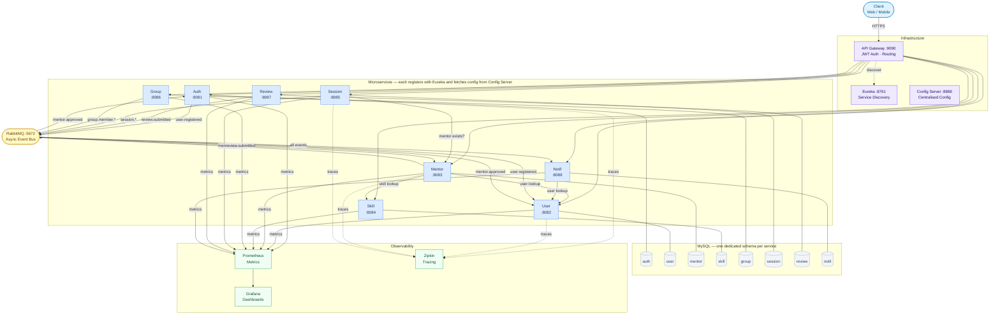

# SkillSync — High-Level Design

---

## Component Summary

| Component | Port | Role |
|---|---|---|
| **API Gateway** | 9090 | Single entry point — JWT validation, routing, load balancing |
| **Eureka Server** | 8761 | Service registry and client-side discovery |
| **Config Server** | 8888 | Externalised configuration for all services |
| **Auth Service** | 8081 | User registration, login, JWT issuance and refresh |
| **User Service** | 8082 | User profile management, admin operations |
| **Mentor Service** | 8083 | Mentor application, discovery, availability, rating |
| **Skill Service** | 8084 | Skill catalog — read-only for users, CRUD for admins |
| **Group Service** | 8086 | Study group creation, membership management |
| **Session Service** | 8085 | Mentoring session booking and lifecycle (requested → completed) |
| **Review Service** | 8087 | Post-session ratings and feedback submission |
| **Notification Service** | 8088 | Email and in-app notifications triggered by domain events |
| **RabbitMQ** | 5672 | Async event bus decoupling all producers from consumers |
| **MySQL** | — | One dedicated schema per service (database-per-service pattern) |
| **Prometheus** | — | Metrics scraping via `/actuator/prometheus` on all services |
| **Zipkin** | — | Distributed trace collection via Micrometer Brave bridge |
| **Grafana** | — | Unified observability dashboards sourced from Prometheus |

---

## Key Design Patterns

- **API Gateway Pattern** — all external traffic enters through a single gateway with JWT authentication and route-level filtering
- **Database per Service** — each microservice owns its schema; no cross-service DB joins
- **Event-Driven Architecture** — domain events over RabbitMQ decouple services and drive side effects (notifications, role updates, rating recalculations)
- **Synchronous Feign Clients** — used only for mandatory, real-time validation (mentor existence check, user/skill lookups)
- **Centralised Configuration** — all service properties externalised to Config Server backed by Git
- **Service Discovery** — Eureka enables location-transparent load-balanced calls between services
- **Observability** — Prometheus + Grafana for metrics, Zipkin for distributed tracing across service boundaries
